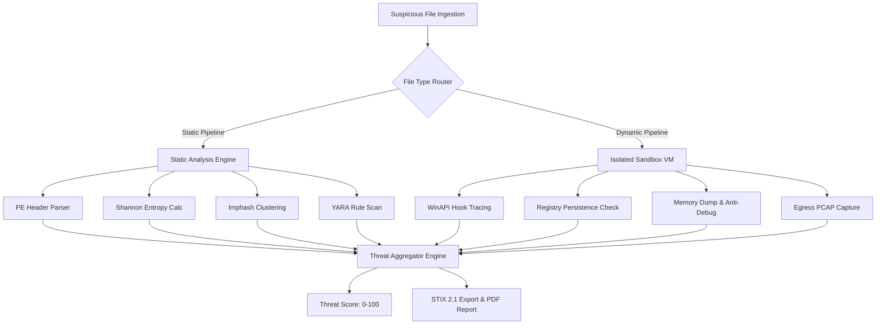

# Automated Malware & Mobile App Analysis Pipeline

In modern Security Operations Centers (SOCs) and state-level cyber forensics units, rapidly triaging malicious binaries, obfuscated scripts, and suspicious APKs is critical to neutralizing ransomware outbreaks and advanced persistent threats (APTs).

<StatGrid>
  <StatCard label="Triage Speed" value="80% Faster" description="vs manual Ghidra analysis" trend="+80%" />
  <StatCard label="Entropy Threshold" value="7.2 H" description="Flags packing / encryption" />
  <StatCard label="IOC Output" value="STIX 2.1" description="MISP & Splunk compatible" />
</StatGrid>

<Callout type="cyber" title="Forensics Objective">
Automating the extraction of command-and-control (C2) domains, hardcoded cryptographic keys, and process injection hooks without executing untrusted binaries on host bare-metal machines.
</Callout>

---

## Technical Pipeline & Flowchart Architecture



---

## Static Inspection Feature Matrix

The static engine inspects Portable Executable (PE) headers, Android DEX bytecode, and Mach-O binaries to extract heuristics:

| Analysis Module | Extracted Features | Threat Indicator Trigger | Risk Weight |
| :--- | :--- | :--- | :--- |
| **Shannon Entropy** | Section byte distribution (`.text`, `.rsrc`) | Entropy > 7.0 (UPX, Themida, VMProtect) | High |
| **Import Address Table** | `Imphash` + API calls (`VirtualAllocEx`) | Process Injection / Memory Hollowing | Critical |
| **Export Directory** | Exported ordinal names, DLL hijacking slots | Fake system DLL proxying | Medium |
| **String Extractor** | Floss-decrypted strings, XOR keys | C2 IPs, Onion domains, Base64 blobs | High |
| **YARA Compiler** | Bytecode pattern matching | Known APT28, Lazarus, LockBit signatures | Critical |

---

## Dynamic Behavioral Sandbox & WinAPI Hooking

<Terminal title="sandbox_telemetry_stream.log - Hooked Win32 API Calls">
```bash
[+] 14:32:01.102 [SANDBOX-INIT] Spawning isolated Windows 11 VM (Hyper-V / Cuckoo)
[+] 14:32:01.320 [PROCESS-SPAWN] sample_malware.exe PID: 4912
[!] 14:32:01.410 [API-HOOK] VirtualAllocEx(hProcess=0xFFFFFFFE, flProtect=PAGE_EXECUTE_READWRITE)
[!] 14:32:01.488 [API-HOOK] WriteProcessMemory(hProcess=0x00000492, lpBuffer=0x00401000)
[!] 14:32:01.550 [REGISTRY-MUTATION] SetValueKey: HKCU\Software\Microsoft\Windows\CurrentVersion\Run
[-] 14:32:01.710 [NETWORK-EGRESS] SocketConnect -> 192.168.1.50:4444 (Beaconing SYN sent)
[✓] 14:32:01.890 [TRIAGE-COMPLETE] Threat Score: 98/100 (CRITICAL RISK) - STIX 2.1 Generated
```
</Terminal>

<Callout type="danger" title="Evasion Detection">
The engine monitors runtime evasion attempts including `IsDebuggerPresent()`, `CheckRemoteDebuggerPresent()`, and RDTSC timing checks to catch sandbox-aware malware before it terminates execution.
</Callout>

---

## Python Entropy & PE Inspection Core

```python
import math
import pefile
from typing import Dict, Any

def compute_section_entropy(data: bytes) -> float:
    """Calculates Shannon Entropy to identify packed/encrypted bytecode."""
    if not data:
        return 0.0
    
    entropy = 0.0
    length = len(data)
    byte_counts = [0] * 256
    
    for b in data:
        byte_counts[b] += 1
        
    for count in byte_counts:
        if count == 0:
            continue
        prob = count / length
        entropy -= prob * math.log2(prob)
        
    return entropy

def analyze_pe_binary(filepath: str) -> Dict[str, Any]:
    """Inspects binary sections, IAT hashes, and calculates threat indicators."""
    pe = pefile.PE(filepath)
    results = {
        "imphash": pe.get_imphash(),
        "sections": [],
        "is_packed": False
    }
    
    for section in pe.sections:
        name = section.Name.decode('utf-8', errors='ignore').strip('\x00')
        entropy = compute_section_entropy(section.get_data())
        packed = entropy > 7.0
        
        if packed:
            results["is_packed"] = True
            
        results["sections"].append({
            "name": name,
            "size": section.SizeOfRawData,
            "entropy": round(entropy, 2),
            "status": "PACKED" if packed else "CLEAN"
        })
        
    return results
```

---

## Summary & Threat Defense Integration

<Callout type="success" title="SOC Operational Output">
Extracted Indicators of Compromise (IoCs) are automatically formatted into STIX 2.1 and YARA rule templates, enabling automated push to Splunk Enterprise Security and Palo Alto Cortex XSOAR within seconds.
</Callout>

- **Repository**: [https://github.com/rdxkeerthi/Malware-analysis-App-analysis-tool](https://github.com/rdxkeerthi/Malware-analysis-App-analysis-tool)
- **Author**: Keerthivasan M
- **License**: MIT
