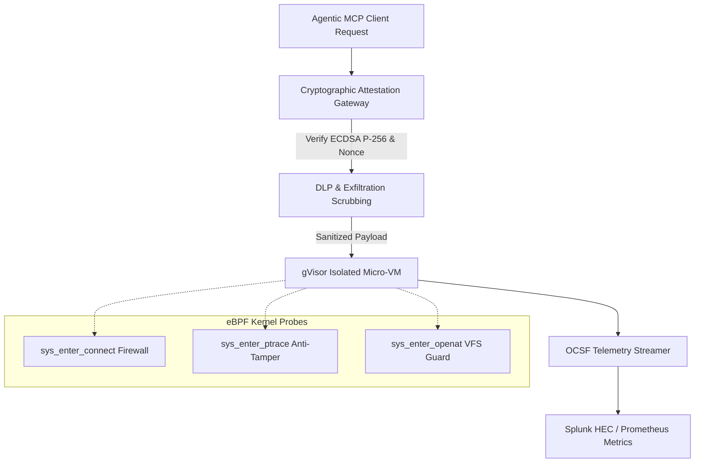

# NexisCore: Zero-Trust Runtime Sandbox & Cryptographic Attestation Engine

Modern AI agentic workflows built on the **Model Context Protocol (MCP)** enable Large Language Models (LLMs) to execute tools, interact with file systems, query databases, and execute arbitrary code. 

<StatGrid>
  <StatCard label="Attestation Lag" value="< 1.2ms" description="ECDSA P-256 validation" trend="Ultra-fast" />
  <StatCard label="Egress Detection" value="100%" description="eBPF sys_enter_connect" />
  <StatCard label="Memory Idle" value="< 25 MB" description="Lightweight Go runtime" />
</StatGrid>

<Callout type="cyber" title="Zero-Trust Boundary">
NexisCore acts as a runtime gateway wrapping every MCP tool invocation inside a multi-layered cryptographic and kernel-isolated security envelope.
</Callout>

---

## Technical Architecture & Enforcement Grid



---

## Core Security Pillars

### 1. Cryptographic Provenance Attestation & Replay Prevention
Every MCP tool request must include an **ECDSA P-256 digital signature**, a cryptographic nonce, and a UNIX epoch timestamp within its request manifest:
- **ASN.1 Coordinate Decoding**: Decodes $(R, S)$ signature parameters and verifies them against the registered agent's public key.
- **Epoch Drift Validation**: Rejects requests where the timestamp drifts beyond a strict configurable window (within 30 seconds) to defeat delayed playback attacks.
- **Sliding-Window Nonce Cache**: Maintains a high-speed lock-free ring cache storing active nonces, instantly rejecting duplicate submissions.

### 2. eBPF-Powered Kernel Isolation & Tracepoint Monitoring
While containers isolate namespaces, NexisCore attaches low-overhead **eBPF** kprobes and tracepoints directly inside the Linux kernel:
- **Network Egress Firewall (`sys_enter_connect`)**: If a sandboxed tool attempts to open a socket connection outside pre-approved allowlists, the eBPF program instantly triggers `bpf_send_signal(SIGKILL)`, terminating the process.
- **Anti-Tampering Probes (`sys_enter_ptrace`, `sys_enter_mprotect`)**: Blocks debugger attachment or execution of self-modifying code pages within the attestation runtime itself.

---

## Go Attestation Engine Snippet

```go
package gateway

import (
    "crypto/ecdsa"
    "crypto/sha256"
    "errors"
    "math/big"
    "time"
)

type AttestationManifest struct {
    AgentID   string `json:"agent_id"`
    Payload   []byte `json:"payload"`
    Nonce     string `json:"nonce"`
    Timestamp int64  `json:"timestamp"`
    R         *big.Int
    S         *big.Int
}

func (gw *Gateway) ValidateProvenance(m *AttestationManifest, pubKey *ecdsa.PublicKey) error {
    // 1. Check Temporal Freshness
    if time.Now().Unix()-m.Timestamp > 30 {
        return errors.New("attestation token expired (epoch drift)")
    }

    // 2. Check Sliding Window Nonce Cache
    if gw.nonceCache.Has(m.Nonce) {
        return errors.New("replay attack detected: nonce already spent")
    }
    gw.nonceCache.Add(m.Nonce)

    // 3. Compute SHA-256 Payload Hash
    hash := sha256.Sum256(m.Payload)

    // 4. Verify ECDSA P-256 Signature
    if !ecdsa.Verify(pubKey, hash[:], m.R, m.S) {
        return errors.New("invalid signature: payload has been tampered with")
    }

    return nil
}
```

---

## Summary & Impact

- **GitHub Repository**: [rdxkeerthi/NexisCore](https://github.com/rdxkeerthi/NexisCore)
- **Primary Stack**: Go, eBPF (Cilium/ebpf), gVisor, OCSF
- **License**: MIT
