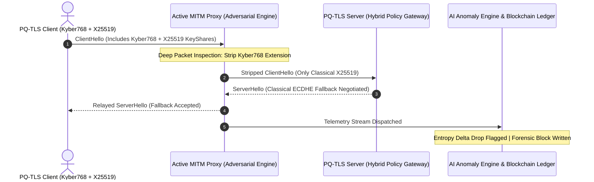

# Post-Quantum TLS Readiness & Downgrade Attack Simulator

With the impending arrival of Cryptographically Relevant Quantum Computers (CRQCs), traditional public-key cryptosystems based on prime factorization (RSA) and discrete logarithms (ECDHE, ECDSA) will be broken by Shor's algorithm in polynomial time.

<StatGrid>
  <StatCard label="NIST Standard" value="FIPS 203/204" description="ML-KEM & ML-DSA approved" />
  <StatCard label="Overhead" value="+0.42ms" description="Hybrid P256 + Kyber768" trend="Optimal" />
  <StatCard label="Downgrade Risk" value="Critical" description="Active MITM Fallback Vector" />
</StatGrid>

<Callout type="danger" title="The Harvest Now, Decrypt Later (HNDL) Threat">
Nation-state adversaries and threat actors are intercepting and storing encrypted high-value enterprise and government data streams today. Once scalable quantum computers become operational, stored ciphertexts will be decrypted retrospectively unless encrypted with quantum-resistant algorithms.
</Callout>

---

## Technical Architecture & Attack Flow Topology

During the transition decade, infrastructure must operate in **Hybrid Modes** combining classical and post-quantum keys. This hybrid era exposes network channels to active Man-in-the-Middle (MITM) **Downgrade Attacks**, where attackers strip post-quantum extensions to force endpoints back into vulnerable legacy ciphersuites.



---

## NIST Post-Quantum Algorithm Parameter Comparison

The simulator benchmarks classical vs. post-quantum key sizes, encapsulation latency, and bandwidth requirements:

| Algorithm | Type | NIST Level | Public Key Size | Ciphertext / Sig | Security Assumption |
| :--- | :--- | :--- | :--- | :--- | :--- |
| **ML-KEM (Kyber-512)** | KEM | Level 1 (AES-128) | 800 bytes | 768 bytes | Module-LWE (Lattice) |
| **ML-KEM (Kyber-768)** | KEM | Level 3 (AES-192) | 1,184 bytes | 1,088 bytes | Module-LWE (Lattice) |
| **ML-KEM (Kyber-1024)** | KEM | Level 5 (AES-256) | 1,568 bytes | 1,568 bytes | Module-LWE (Lattice) |
| **ML-DSA (Dilithium3)** | Signature | Level 3 (AES-192) | 1,952 bytes | 3,293 bytes | Module-LWE (Lattice) |
| **FN-DSA (Falcon-512)** | Signature | Level 1 (AES-128) | 897 bytes | 666 bytes | NTRU Lattices |
| **ECDH (X25519 - Legacy)** | Classic KEM | 0 (Broken by QC) | 32 bytes | 32 bytes | Elliptic Curve DLP |
| **RSA-4096 (Legacy)** | Classic KEM | 0 (Broken by QC) | 512 bytes | 512 bytes | Integer Factorization |

<Callout type="cyber" title="Key Engineering Trade-off">
While classical ECDH keys require only **32 bytes**, Kyber-768 public keys require **1,184 bytes**. The simulator measures the exact fragmentation penalty across MTU boundaries (1500 bytes) and TCP window scaling.
</Callout>

---

## Active Downgrade Attack Scenarios

<Terminal title="packet_capture_stream.py - Wireshark / Scapy Inspection">
```bash
[+] 14:32:01.042 [INGRESS] TLS 1.3 ClientHello (len=1642 bytes)
[+] 14:32:01.043 [INSPECT] KeyShare Extension found: ID=0x0035, Group=0xfe30 (Kyber768)
[!] 14:32:01.044 [ATTACK-VECTOR] Executing CVE-Emulation: STRIP_PQ_KEY_SHARE
[-] 14:32:01.045 [MUTATE] Stripped 1184 bytes from payload. Adjusted TLS record length.
[+] 14:32:01.046 [EGRESS] Forwarded sanitized ClientHello (len=458 bytes) -> Server:443
[!] 14:32:01.049 [ALERT] AI Engine Flagged Anomaly: Entropy delta drop from 7.91 to 5.82
[✓] 14:32:01.052 [LEDGER] Forensic event written to Anti-Tamper Block #104928
```
</Terminal>

The simulator implements 4 distinct active downgrade attack engines:

1. **Extension Stripping (`STRIP_PQ_KEY_SHARE`)**: Intercepts `ClientHello` and zeroes out the NIST PQC extension flags, tricking the server into believing the client only supports classical ECDHE.
2. **Cipher Suite Manipulation (`DOWNGRADE_CIPHER_SUITE`)**: Mutates cipher suite priority lists to prioritize legacy TLS 1.2 RSA cipher suites over TLS 1.3 `TLS_AES_256_GCM_SHA384`.
3. **Fragment Poisoning (`CORRUPT_PQC_PAYLOAD`)**: Injects targeted bit-flips into Kyber polynomial coefficients to test client boundary panic states and fallback exceptions.
4. **Certificate Downgrade (`STRIP_DILITHIUM_SIG`)**: Forces intermediate CA validation fallback from post-quantum signatures to classical SHA-256 with RSA.

---

## Python Simulation Proxy Implementation

```python
import struct
import socket
from typing import Tuple

EXTENSION_KEY_SHARE = 0x0035
PQ_GROUP_KYBER768   = 0xfe30
CLASSICAL_X25519    = 0x001d

class PostQuantumDowngradeEngine:
    def __init__(self, target_host: str, target_port: int, aggressive_mode: bool = False):
        self.target = (target_host, target_port)
        self.aggressive = aggressive_mode

    def audit_and_tamper_client_hello(self, raw_packet: bytes) -> Tuple[bytes, bool]:
        """
        Inspects TLS 1.3 ClientHello record, parses Extension headers,
        and dynamically strips Post-Quantum Key Shares.
        """
        if len(raw_packet) < 5:
            return raw_packet, False

        content_type, version, length = struct.unpack("!BHH", raw_packet[:5])
        
        # 0x16 = 22 (TLS Handshake Protocol)
        if content_type != 0x16:
            return raw_packet, False

        # Scan for Kyber768 Group Tag (0xfe 0x30)
        kyber_signature = bytes([0xfe, 0x30])
        if kyber_signature in raw_packet:
            print("[ALERT] Detected Kyber768 Key Encapsulation in Handshake!")
            
            if self.aggressive:
                # Force downgrade: Replace Kyber768 extension with classical X25519
                tampered = raw_packet.replace(kyber_signature, bytes([0x00, 1]))
                return tampered, True

        return raw_packet, False
```

---

## Real-World Defensive Strategies & Takeaways

<Callout type="success" title="Production Migration Guidelines">
1. **Disable Unauthenticated Legacy Fallbacks**: Enforce strict server policies where connections rejecting post-quantum key shares are terminated immediately rather than renegotiated.
2. **Deploy Cryptographic Agility**: Adopt abstraction libraries (such as OpenSSL 3.2 OQS Provider) allowing instant algorithm swapping without rewriting network application logic.
3. **Continuous Entropy Monitoring**: Monitor packet size variance at WAF / ingress load balancers to detect subtle MITM stripping attacks in transit.
</Callout>

- **Repository**: [https://github.com/rdxkeerthi/Post-Quantum-TLS-Simulator](https://github.com/rdxkeerthi/Post-Quantum-TLS-Simulator)
- **Author**: Keerthivasan M
- **License**: MIT
